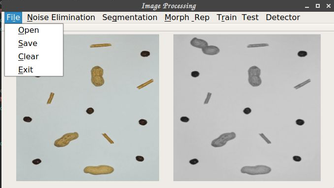
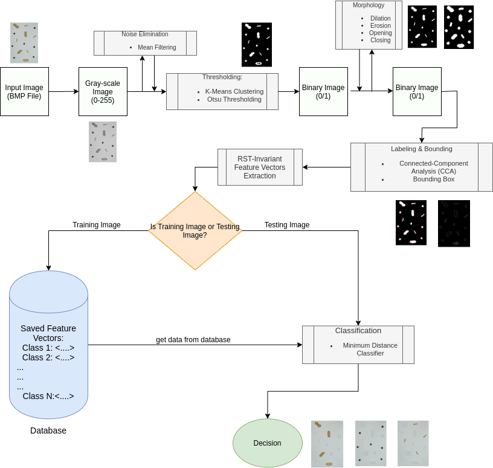
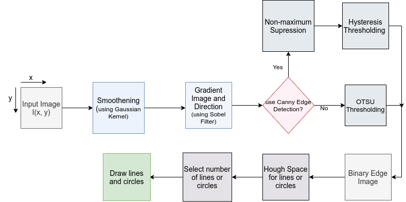

# Image Processing App

This project consist of the implementation of image processing projects **without** the use of any image processing library (such as opencv). It was implemented with ​[Qt development software](https://wiki.qt.io/Main) on a Linux platform and the used language is C++. The projects implemented so far are:  

1. **Object Detection and Classification based on Geometric Invariant Moment.**  
2. **Line and Circle detection based on Hough Transform.**
<p align="center">
  
</p>

## Project 1: Object Detection and Classification based on Geometric Invariant Moment

This project consist of the implementation of objects detection and classification program which detects and classifies objects (such as rice, beans, etc.) based on their geometric shape. The processes that are implemented in this project are:

* Noise Elimination
	* Mean Filtering
* Image Segmentation
	* OTSU Thresholding
  	* K-Means Cluster Binary Thresholding
* Morphological Image Processing
  	* Dilation
  	* Erosion
  	* Opening
  	* Closing
  	* Boundary Extraction
* Labeling and Bounding
	* Connected-component Analysis (CCA)
	* Drawing Bound Boxes
* RST-invariant moment-based feature extraction and feature analysis 
* Distance based supervised learning for image classification

The diagram below shows a typical image processing system and the sub-processes involved in this project:
<p align="center">
  
</p>


## Project 2: Line and Circle detection based on Hough Transform

This project consist of the implementation of lines and circles detection program using Hough Transform. This project is the extension of the Object detecting and classifying application’s components. The processes that are implemented in this project are:

* Smoothing
	* Gaussian Blur(Gaussian Smoothing)
* Edge Detection
  	* Sobel Edge Detection
  	* Canny Edge Detection
  		* Non-maximum Suppression
  		* Hysteresis thresholding
* Hough Line Transform
* Hough Circle Transform

The diagram below shows the sub-processes involved in this project:
<p align="center">
  
</p>

## Getting Started

These instructions will get you a copy of the project up and running on your local machine for development and testing purposes.

### Prerequisites
Linux Machine with QT5 Creator.

### Downloading
Cloning The GitHub Repository

```
git clone https://github.com/OluwaseunOjeleye/Objects-Detection-and-Classification---Line-and-Circle-Detection-App.git
```
### How to use the program
Once you've cloned the repository, instructions on how to use the application can be found in [Report.pdf](https://github.com/OluwaseunOjeleye/Objects-Detection-and-Classification---Line-and-Circle-Detection-App/blob/master/Report.pdf)

## Author
* **Jamiu Oluwaseun Ojeleye** 
